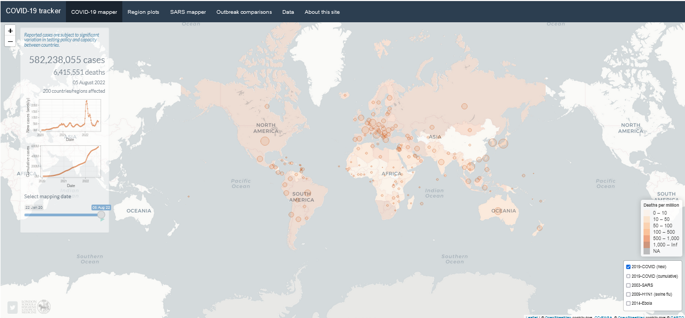
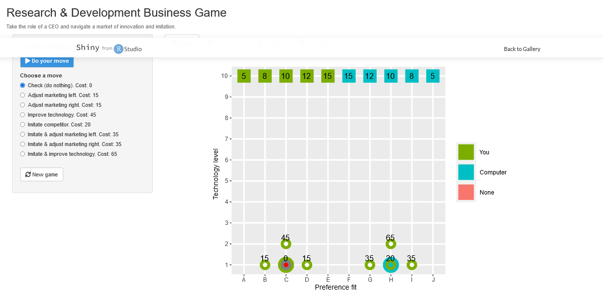
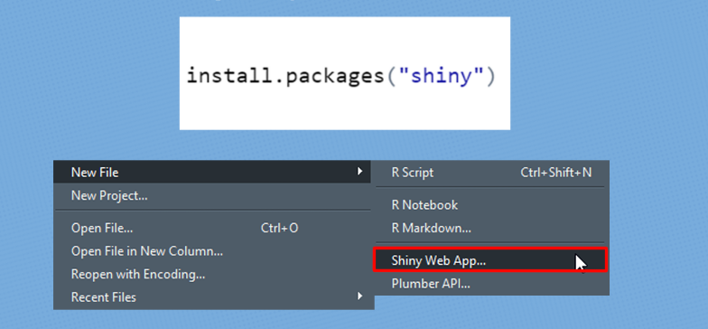
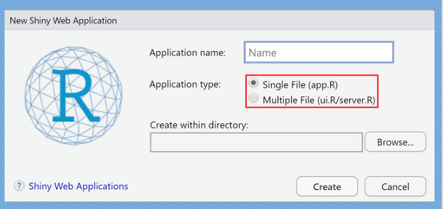
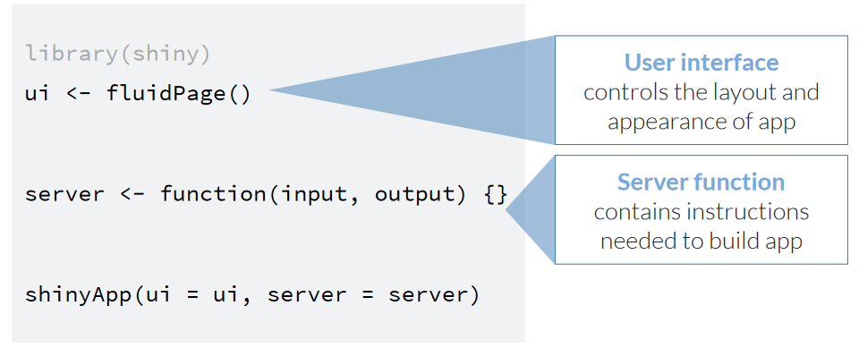
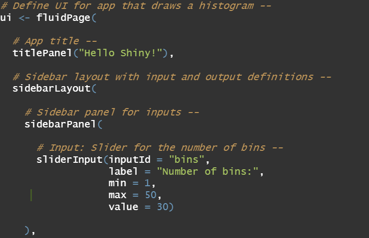
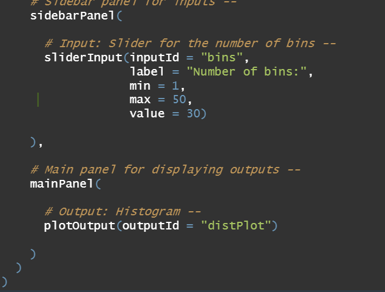
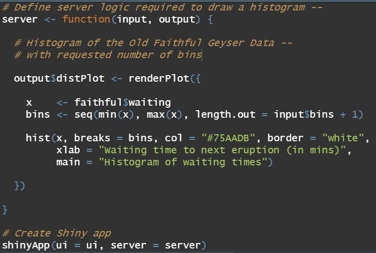
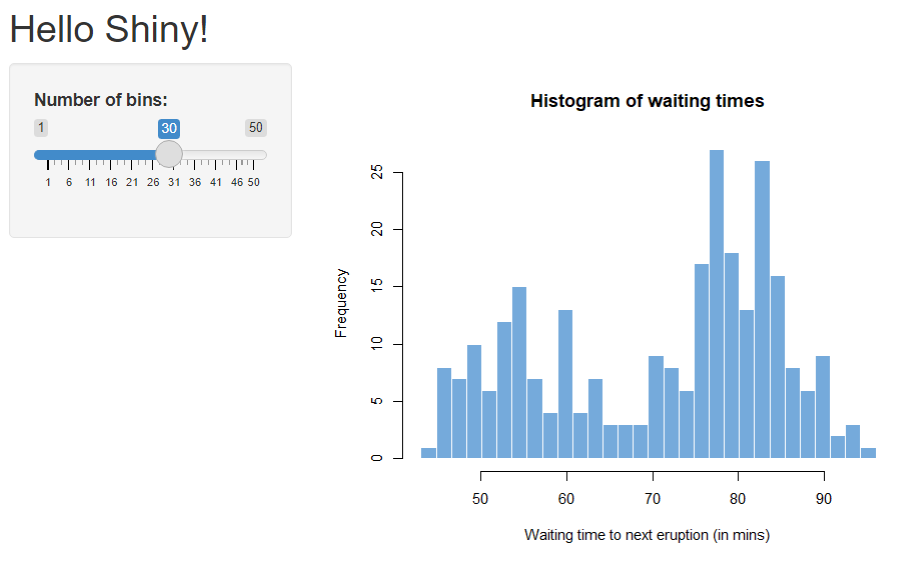

```{r setup, include=FALSE}
knitr::opts_chunk$set(
	echo = TRUE,
	error = FALSE,
	message = FALSE,
	warning = FALSE
)
```


# Sumário

## Conteúdo da Apresentação:
  
   - Introdução;
   - A Interface geral do Shiny;
   - UI;
   - Server;
   - Estética do Shiny;
   - Dashboard;
   - Publicação.
  

# Introdução

## O que é o Shiny?

- O **Shiny** é um pacote do R que possibilita a criação de aplicativos web no formato HTML. 

- Permite alocar um trabalho do R em um navegador da web. O objetivo é criar um produto (dashboards, apresentações, jogos, etc.) para que qualquer pessoa possa acessar e interagir.
 
- O Shiny **não** é uma página web!

## Exemplo: Dashboard



- [Galeria do Shiny - shiny.rstudio.com/gallery/](https://shiny.rstudio.com/gallery/)

## Exemplo: Jogos



- [Galeria do Shiny - shiny.rstudio.com/gallery/](https://shiny.rstudio.com/gallery/)

## Vantagens do Shiny


- Integração com o R;

- Seu framework permite criar aplicações web sem ter nenhum conhecimento prévio em HTML, CSS ou JavaScript;

- Criação de painéis interativos e liberdade ao usuário.


## Instalação e Execução



<bdi style="font-size:600%" class=white> ------ </bdi> 


# Interface do Shiny

## UI e Server

> - **UI - Interface do Usuário:** está relacionada com todas as coisas que os usuários vão ver e interagir:
> - Textos; 

> - Inputs;

> - Onde alocar os outputs/resultados;
  
> - **SERVER:** no Server vai acontecer todo o processamento de dados que o aplicativo vai fazer como cálculos e geração de gráficos de acordo com os inputs do usuário.
  
## UI e Server




## Exemplo: Gerando um Histograma

<bdi style="font-size:250%" class=white> ------ </bdi> 

## Exemplo: Gerando um Histograma

<bdi style="font-size:300%" class=white> ------ </bdi> 

## Exemplo: Gerando um Histograma

<bdi style="font-size:250%" class=white> ------ </bdi> 

## Exemplo: Gerando um Histograma

<bdi style="font-size:250%" class=white> ------ </bdi> 

## Continuação