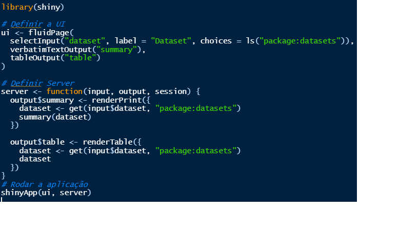
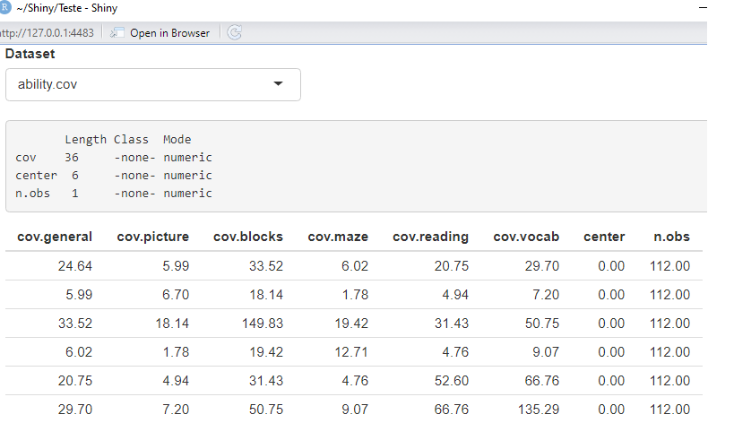
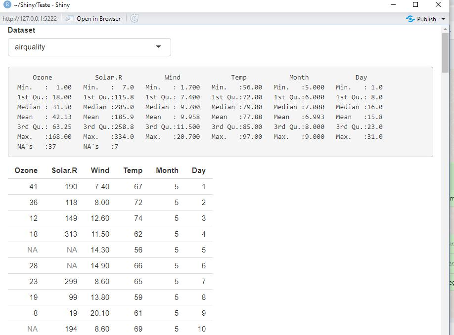
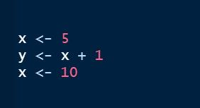
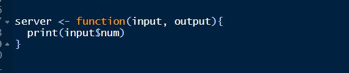
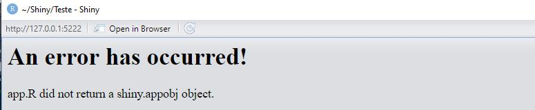
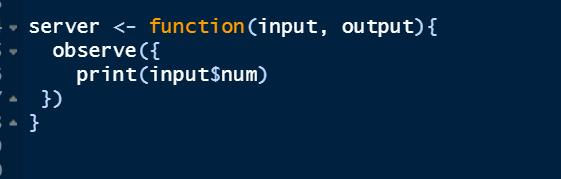
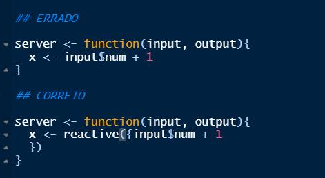

```{r setup, include=FALSE}
knitr::opts_chunk$set(
	echo = TRUE,
	error = FALSE,
	message = FALSE,
	warning = FALSE
)
```


## Server

 - No Server vai acontecer todo o processamento de dados que o aplicativo vai fazer como cálculos e geração de gráficos de acordo com os inputs do usuário;
  
 - A função Server vai especificar o comportamento da aplicação;

 - Para que esse processo ocorra, será necessário o uso da função Render.

## Função Render

- Cada função Render é definida para produzir um tipo específico de saída:

- renderPlot() - Gráficos;

- renderPrint() - Qualquer print;

- renderTable() - Diversas estruturas em forma de tabela;

- renderDataTable() - Data frames;

- renderImage() - Imagens;

- renderText() - Strings.


## Exemplo em aplicação 



## Interface visual



## Resultado da Aplicação



## Reatividade

- Essência da reatividade: saídas reagem (recálculo) automaticamente quando suas entradas mudam.



## Contexto Reativo

- Valores reativos só podem ser usados se estiverem inseridos em um contexto reativo:



## Erro



## Observe

- O observe({...}) é usado para acessar valores reativos:



## Outras funções

- reactive({...}) cria variáveis reativas.



## Publicação na Web

- O R studio oferece a publicação via Web de três formas:

- Shinyapps.io: <https://www.shinyapps.io/>;

- Shiny Server: <https://marcusnunes.me/posts/como-instalar-o-shiny-em-seu-proprio-servidor/>;

- RStudio Connect: <https://www.rstudio.com/products/connect/>.


